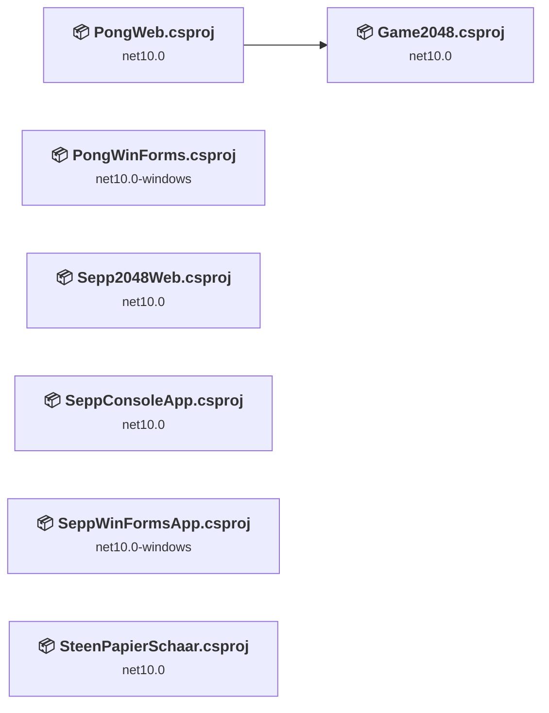
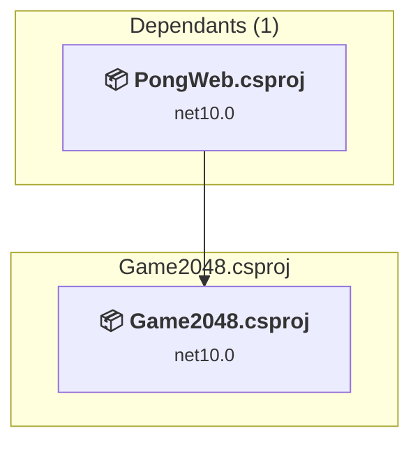
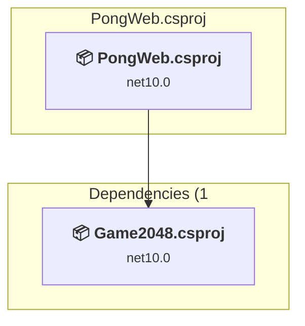
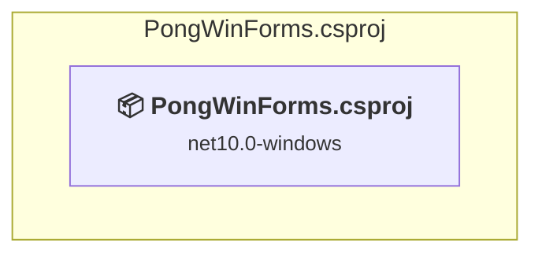
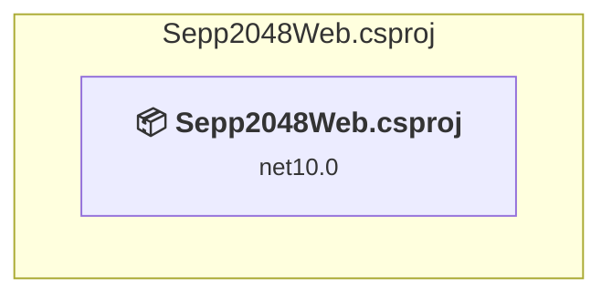
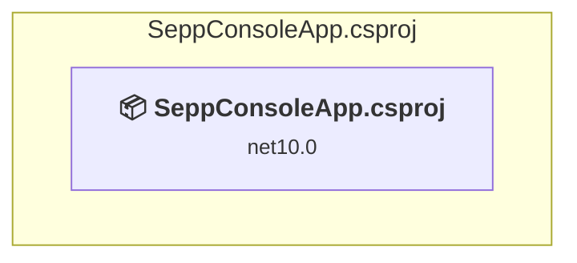
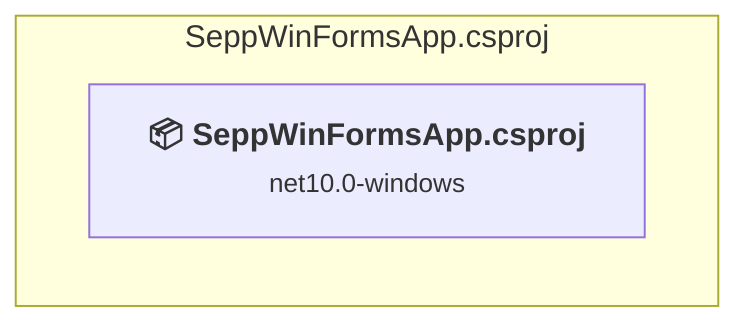
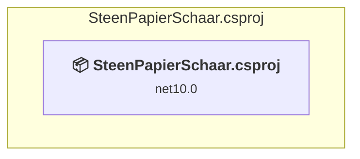

# Projects and dependencies analysis

This document provides a comprehensive overview of the projects and their dependencies in the context of upgrading to .NETCoreApp,Version=v11.0.

## Table of Contents

- [Executive Summary](#executive-Summary)
  - [Highlevel Metrics](#highlevel-metrics)
  - [Projects Compatibility](#projects-compatibility)
  - [Package Compatibility](#package-compatibility)
  - [API Compatibility](#api-compatibility)
  - [Binding Redirect Configuration](#binding-redirect-configuration)
- [Aggregate NuGet packages details](#aggregate-nuget-packages-details)
- [Top API Migration Challenges](#top-api-migration-challenges)
  - [Technologies and Features](#technologies-and-features)
  - [Most Frequent API Issues](#most-frequent-api-issues)
- [Projects Relationship Graph](#projects-relationship-graph)
- [Project Details](#project-details)

  - [Game2048\Game2048.csproj](#game2048game2048csproj)
  - [PongWeb\PongWeb.csproj](#pongwebpongwebcsproj)
  - [PongWinForms\PongWinForms.csproj](#pongwinformspongwinformscsproj)
  - [Sepp2048Web\Sepp2048Web.csproj](#sepp2048websepp2048webcsproj)
  - [SeppConsoleApp\SeppConsoleApp.csproj](#seppconsoleappseppconsoleappcsproj)
  - [SeppWinFormsApp\SeppWinFormsApp.csproj](#seppwinformsappseppwinformsappcsproj)
  - [SteenPapierSchaar\SteenPapierSchaar.csproj](#steenpapierschaarsteenpapierschaarcsproj)

## Executive Summary

### Highlevel Metrics

| Metric | Count | Status |
| :--- | :---: | :--- |
| Total Projects | 7 | All require upgrade |
| Total NuGet Packages | 31 | All compatible |
| Total Code Files | 25 |  |
| Total Code Files with Incidents | 22 |  |
| Total Lines of Code | 4411 |  |
| Total Number of Issues | 2311 |  |
| Estimated LOC to modify | 2304+ | at least 52,2% of codebase |

### Projects Compatibility

| Project | Target Framework | Difficulty | Package Issues | API Issues | Binding Issues | Est. LOC Impact | Description |
| :--- | :---: | :---: | :---: | :---: | :---: | :---: | :--- |
| [Game2048\Game2048.csproj](#game2048game2048csproj) | net10.0 | 🟢 Low | 0 | 0 | 0 |  | ClassLibrary, Sdk Style = True |
| [PongWeb\PongWeb.csproj](#pongwebpongwebcsproj) | net10.0 | 🟢 Low | 0 | 3 | 0 | 3+ | AspNetCore, Sdk Style = True |
| [PongWinForms\PongWinForms.csproj](#pongwinformspongwinformscsproj) | net10.0-windows | 🟡 Medium | 0 | 1682 | 0 | 1682+ | WinForms, Sdk Style = True |
| [Sepp2048Web\Sepp2048Web.csproj](#sepp2048websepp2048webcsproj) | net10.0 | 🟢 Low | 0 | 1 | 0 | 1+ | AspNetCore, Sdk Style = True |
| [SeppConsoleApp\SeppConsoleApp.csproj](#seppconsoleappseppconsoleappcsproj) | net10.0 | 🟢 Low | 0 | 0 | 0 |  | DotNetCoreApp, Sdk Style = True |
| [SeppWinFormsApp\SeppWinFormsApp.csproj](#seppwinformsappseppwinformsappcsproj) | net10.0-windows | 🟡 Medium | 0 | 618 | 0 | 618+ | WinForms, Sdk Style = True |
| [SteenPapierSchaar\SteenPapierSchaar.csproj](#steenpapierschaarsteenpapierschaarcsproj) | net10.0 | 🟢 Low | 0 | 0 | 0 |  | DotNetCoreApp, Sdk Style = True |

### Package Compatibility

| Status | Count | Percentage |
| :--- | :---: | :---: |
| ✅ Compatible | 31 | 100,0% |
| ⚠️ Incompatible | 0 | 0,0% |
| 🔄 Upgrade Recommended | 0 | 0,0% |
| ***Total NuGet Packages*** | ***31*** | ***100%*** |

### API Compatibility

| Category | Count | Impact |
| :--- | :---: | :--- |
| 🔴 Binary Incompatible | 2086 | High - Require code changes |
| 🟡 Source Incompatible | 214 | Medium - Needs re-compilation and potential conflicting API error fixing |
| 🔵 Behavioral change | 4 | Low - Behavioral changes that may require testing at runtime |
| ✅ Compatible | 9917 |  |
| ***Total APIs Analyzed*** | ***12221*** |  |

## Aggregate NuGet packages details

| Package | Current Version | Suggested Version | Projects | Description |
| :--- | :---: | :---: | :--- | :--- |
| Microsoft.AspNetCore.App.Internal.Assets | 10.0.12 |  | [PongWeb.csproj](#pongwebpongwebcsproj) [Sepp2048Web.csproj](#sepp2048websepp2048webcsproj) | ✅Compatible |
| Microsoft.AspNetCore.Authorization | 10.0.12 |  | [Game2048.csproj](#game2048game2048csproj) [PongWeb.csproj](#pongwebpongwebcsproj) | ✅Compatible |
| Microsoft.AspNetCore.Components | 10.0.12 |  | [Game2048.csproj](#game2048game2048csproj) [PongWeb.csproj](#pongwebpongwebcsproj) | ✅Compatible |
| Microsoft.AspNetCore.Components.Analyzers | 10.0.12 |  | [Game2048.csproj](#game2048game2048csproj) [PongWeb.csproj](#pongwebpongwebcsproj) | ✅Compatible |
| Microsoft.AspNetCore.Components.Forms | 10.0.12 |  | [Game2048.csproj](#game2048game2048csproj) [PongWeb.csproj](#pongwebpongwebcsproj) | ✅Compatible |
| Microsoft.AspNetCore.Components.Web | 10.0.12 |  | [Game2048.csproj](#game2048game2048csproj) [PongWeb.csproj](#pongwebpongwebcsproj) | ✅Compatible |
| Microsoft.AspNetCore.Components.WebAssembly | 10.0.12 |  | [PongWeb.csproj](#pongwebpongwebcsproj) | ✅Compatible |
| Microsoft.AspNetCore.Components.WebAssembly.DevServer | 10.0.12 |  | [PongWeb.csproj](#pongwebpongwebcsproj) | ✅Compatible |
| Microsoft.AspNetCore.Metadata | 10.0.12 |  | [Game2048.csproj](#game2048game2048csproj) [PongWeb.csproj](#pongwebpongwebcsproj) | ✅Compatible |
| Microsoft.Extensions.Configuration | 10.0.12 |  | [Game2048.csproj](#game2048game2048csproj) [PongWeb.csproj](#pongwebpongwebcsproj) | ✅Compatible |
| Microsoft.Extensions.Configuration.Abstractions | 10.0.12 |  | [Game2048.csproj](#game2048game2048csproj) [PongWeb.csproj](#pongwebpongwebcsproj) | ✅Compatible |
| Microsoft.Extensions.Configuration.Binder | 10.0.12 |  | [Game2048.csproj](#game2048game2048csproj) [PongWeb.csproj](#pongwebpongwebcsproj) | ✅Compatible |
| Microsoft.Extensions.Configuration.FileExtensions | 10.0.12 |  | [PongWeb.csproj](#pongwebpongwebcsproj) | ✅Compatible |
| Microsoft.Extensions.Configuration.Json | 10.0.12 |  | [PongWeb.csproj](#pongwebpongwebcsproj) | ✅Compatible |
| Microsoft.Extensions.DependencyInjection | 10.0.12 |  | [Game2048.csproj](#game2048game2048csproj) [PongWeb.csproj](#pongwebpongwebcsproj) [SteenPapierSchaar.csproj](#steenpapierschaarsteenpapierschaarcsproj) | ✅Compatible |
| Microsoft.Extensions.DependencyInjection.Abstractions | 10.0.12 |  | [Game2048.csproj](#game2048game2048csproj) [PongWeb.csproj](#pongwebpongwebcsproj) [SteenPapierSchaar.csproj](#steenpapierschaarsteenpapierschaarcsproj) | ✅Compatible |
| Microsoft.Extensions.Diagnostics | 10.0.12 |  | [Game2048.csproj](#game2048game2048csproj) [PongWeb.csproj](#pongwebpongwebcsproj) | ✅Compatible |
| Microsoft.Extensions.Diagnostics.Abstractions | 10.0.12 |  | [Game2048.csproj](#game2048game2048csproj) [PongWeb.csproj](#pongwebpongwebcsproj) | ✅Compatible |
| Microsoft.Extensions.FileProviders.Abstractions | 10.0.12 |  | [PongWeb.csproj](#pongwebpongwebcsproj) | ✅Compatible |
| Microsoft.Extensions.FileProviders.Physical | 10.0.12 |  | [PongWeb.csproj](#pongwebpongwebcsproj) | ✅Compatible |
| Microsoft.Extensions.FileSystemGlobbing | 10.0.12 |  | [PongWeb.csproj](#pongwebpongwebcsproj) | ✅Compatible |
| Microsoft.Extensions.Logging | 10.0.12 |  | [PongWeb.csproj](#pongwebpongwebcsproj) | ✅Compatible |
| Microsoft.Extensions.Logging.Abstractions | 10.0.12 |  | [Game2048.csproj](#game2048game2048csproj) [PongWeb.csproj](#pongwebpongwebcsproj) | ✅Compatible |
| Microsoft.Extensions.Options | 10.0.12 |  | [Game2048.csproj](#game2048game2048csproj) [PongWeb.csproj](#pongwebpongwebcsproj) | ✅Compatible |
| Microsoft.Extensions.Options.ConfigurationExtensions | 10.0.12 |  | [Game2048.csproj](#game2048game2048csproj) [PongWeb.csproj](#pongwebpongwebcsproj) | ✅Compatible |
| Microsoft.Extensions.Primitives | 10.0.12 |  | [Game2048.csproj](#game2048game2048csproj) [PongWeb.csproj](#pongwebpongwebcsproj) | ✅Compatible |
| Microsoft.Extensions.Validation | 10.0.12 |  | [Game2048.csproj](#game2048game2048csproj) [PongWeb.csproj](#pongwebpongwebcsproj) | ✅Compatible |
| Microsoft.JSInterop | 10.0.12 |  | [Game2048.csproj](#game2048game2048csproj) [PongWeb.csproj](#pongwebpongwebcsproj) | ✅Compatible |
| Microsoft.JSInterop.WebAssembly | 10.0.12 |  | [PongWeb.csproj](#pongwebpongwebcsproj) | ✅Compatible |
| Microsoft.NET.ILLink.Tasks | 10.0.12 |  | [PongWeb.csproj](#pongwebpongwebcsproj) | ✅Compatible |
| Microsoft.NET.Sdk.WebAssembly.Pack | 10.0.12 |  | [PongWeb.csproj](#pongwebpongwebcsproj) | ✅Compatible |

## Top API Migration Challenges

### Technologies and Features

| Technology | Issues | Percentage | Migration Path |
| :--- | :---: | :---: | :--- |
| Windows Forms | 2086 | 90,5% | Windows Forms APIs for building Windows desktop applications with traditional Forms-based UI that are available in .NET on Windows. Enable Windows Desktop support: Option 1 (Recommended): Target net9.0-windows; Option 2: Add <UseWindowsDesktop>true</UseWindowsDesktop>; Option 3 (Legacy): Use Microsoft.NET.Sdk.WindowsDesktop SDK. |
| GDI+ / System.Drawing | 109 | 4,7% | System.Drawing APIs for 2D graphics, imaging, and printing that are available via NuGet package System.Drawing.Common. Note: Not recommended for server scenarios due to Windows dependencies; consider cross-platform alternatives like SkiaSharp or ImageSharp for new code. |
| Legacy Configuration System | 45 | 2,0% | Legacy XML-based configuration system (app.config/web.config) that has been replaced by a more flexible configuration model in .NET Core. The old system was rigid and XML-based. Migrate to Microsoft.Extensions.Configuration with JSON/environment variables; use System.Configuration.ConfigurationManager NuGet package as interim bridge if needed. |

### Most Frequent API Issues

| API | Count | Percentage | Category |
| :--- | :---: | :---: | :--- |
| T:System.Windows.Forms.NumericUpDown | 140 | 6,1% | Binary Incompatible |
| P:System.Windows.Forms.Control.Width | 78 | 3,4% | Binary Incompatible |
| P:System.Windows.Forms.Control.Top | 77 | 3,3% | Binary Incompatible |
| P:System.Windows.Forms.Control.Left | 77 | 3,3% | Binary Incompatible |
| T:System.Windows.Forms.Control.ControlCollection | 75 | 3,3% | Binary Incompatible |
| P:System.Windows.Forms.Control.Controls | 75 | 3,3% | Binary Incompatible |
| T:System.Windows.Forms.DialogResult | 67 | 2,9% | Binary Incompatible |
| M:System.Windows.Forms.Control.ControlCollection.Add(System.Windows.Forms.Control) | 61 | 2,6% | Binary Incompatible |
| T:System.Windows.Forms.Button | 58 | 2,5% | Binary Incompatible |
| P:System.Windows.Forms.NumericUpDown.Value | 55 | 2,4% | Binary Incompatible |
| P:System.Windows.Forms.Control.ForeColor | 51 | 2,2% | Binary Incompatible |
| T:System.Windows.Forms.RadioButton | 50 | 2,2% | Binary Incompatible |
| T:System.Windows.Forms.Keys | 46 | 2,0% | Binary Incompatible |
| T:System.Media.SoundPlayer | 43 | 1,9% | Source Incompatible |
| P:System.Configuration.ApplicationSettingsBase.Item(System.String) | 38 | 1,6% | Source Incompatible |
| T:System.Windows.Forms.MessageBoxIcon | 36 | 1,6% | Binary Incompatible |
| T:System.Windows.Forms.MessageBoxButtons | 36 | 1,6% | Binary Incompatible |
| T:System.Windows.Forms.ToolStripMenuItem | 35 | 1,5% | Binary Incompatible |
| T:System.Windows.Forms.Label | 35 | 1,5% | Binary Incompatible |
| P:System.Windows.Forms.Form.ClientSize | 31 | 1,3% | Binary Incompatible |
| T:System.Windows.Forms.CheckBox | 30 | 1,3% | Binary Incompatible |
| P:System.Windows.Forms.ButtonBase.Text | 27 | 1,2% | Binary Incompatible |
| T:System.Windows.Forms.FlatStyle | 27 | 1,2% | Binary Incompatible |
| T:System.Windows.Forms.FormBorderStyle | 26 | 1,1% | Binary Incompatible |
| P:System.Windows.Forms.NumericUpDown.Maximum | 26 | 1,1% | Binary Incompatible |
| P:System.Windows.Forms.NumericUpDown.Minimum | 26 | 1,1% | Binary Incompatible |
| M:System.Windows.Forms.NumericUpDown.#ctor | 26 | 1,1% | Binary Incompatible |
| T:System.Windows.Forms.FormStartPosition | 21 | 0,9% | Binary Incompatible |
| T:System.Windows.Forms.MessageBox | 18 | 0,8% | Binary Incompatible |
| M:System.Windows.Forms.MessageBox.Show(System.String,System.String,System.Windows.Forms.MessageBoxButtons,System.Windows.Forms.MessageBoxIcon) | 18 | 0,8% | Binary Incompatible |
| P:System.Windows.Forms.Control.Height | 17 | 0,7% | Binary Incompatible |
| F:System.Windows.Forms.MessageBoxButtons.OK | 16 | 0,7% | Binary Incompatible |
| T:System.Drawing.Font | 16 | 0,7% | Source Incompatible |
| P:System.Windows.Forms.KeyEventArgs.KeyCode | 16 | 0,7% | Binary Incompatible |
| T:System.Windows.Forms.FlatButtonAppearance | 16 | 0,7% | Binary Incompatible |
| P:System.Windows.Forms.ButtonBase.FlatAppearance | 16 | 0,7% | Binary Incompatible |
| T:System.Windows.Forms.AutoScaleMode | 15 | 0,7% | Binary Incompatible |
| P:System.Windows.Forms.RadioButton.Checked | 15 | 0,7% | Binary Incompatible |
| P:System.Windows.Forms.Form.Text | 14 | 0,6% | Binary Incompatible |
| T:System.Drawing.FontStyle | 14 | 0,6% | Source Incompatible |
| P:System.Windows.Forms.NumericUpDown.Increment | 14 | 0,6% | Binary Incompatible |
| P:System.Windows.Forms.CheckBox.Checked | 13 | 0,6% | Binary Incompatible |
| T:System.Windows.Forms.KeyEventHandler | 12 | 0,5% | Binary Incompatible |
| T:System.Windows.Forms.ControlStyles | 12 | 0,5% | Binary Incompatible |
| T:System.Windows.Forms.TextBox | 12 | 0,5% | Binary Incompatible |
| P:System.Windows.Forms.GroupBox.Text | 12 | 0,5% | Binary Incompatible |
| T:System.Windows.Forms.GroupBox | 12 | 0,5% | Binary Incompatible |
| M:System.Windows.Forms.GroupBox.#ctor | 12 | 0,5% | Binary Incompatible |
| T:System.Windows.Forms.MenuStrip | 11 | 0,5% | Binary Incompatible |
| P:System.Windows.Forms.Label.Text | 11 | 0,5% | Binary Incompatible |

## Projects Relationship Graph

Legend:
📦 SDK-style project
⚙️ Classic project

## Project Details

### Game2048\Game2048.csproj

#### Project Info

- **Current Target Framework:** net10.0
- **Proposed Target Framework:** net11.0
- **SDK-style**: True
- **Project Kind:** ClassLibrary
- **Dependencies**: 0
- **Dependants**: 1
- **Number of Files**: 5
- **Number of Files with Incidents**: 1
- **Lines of Code**: 141
- **Estimated LOC to modify**: 0+ (at least 0,0% of the project)

#### Dependency Graph

Legend:
📦 SDK-style project
⚙️ Classic project

### API Compatibility

| Category | Count | Impact |
| :--- | :---: | :--- |
| 🔴 Binary Incompatible | 0 | High - Require code changes |
| 🟡 Source Incompatible | 0 | Medium - Needs re-compilation and potential conflicting API error fixing |
| 🔵 Behavioral change | 0 | Low - Behavioral changes that may require testing at runtime |
| ✅ Compatible | 590 |  |
| ***Total APIs Analyzed*** | ***590*** |  |

### PongWeb\PongWeb.csproj

#### Project Info

- **Current Target Framework:** net10.0
- **Proposed Target Framework:** net11.0
- **SDK-style**: True
- **Project Kind:** AspNetCore
- **Dependencies**: 1
- **Dependants**: 0
- **Number of Files**: 23
- **Number of Files with Incidents**: 2
- **Lines of Code**: 685
- **Estimated LOC to modify**: 3+ (at least 0,4% of the project)

#### Dependency Graph

Legend:
📦 SDK-style project
⚙️ Classic project

### API Compatibility

| Category | Count | Impact |
| :--- | :---: | :--- |
| 🔴 Binary Incompatible | 0 | High - Require code changes |
| 🟡 Source Incompatible | 0 | Medium - Needs re-compilation and potential conflicting API error fixing |
| 🔵 Behavioral change | 3 | Low - Behavioral changes that may require testing at runtime |
| ✅ Compatible | 3481 |  |
| ***Total APIs Analyzed*** | ***3484*** |  |

### PongWinForms\PongWinForms.csproj

#### Project Info

- **Current Target Framework:** net10.0-windows
- **Proposed Target Framework:** net11.0-windows
- **SDK-style**: True
- **Project Kind:** WinForms
- **Dependencies**: 0
- **Dependants**: 0
- **Number of Files**: 11
- **Number of Files with Incidents**: 8
- **Lines of Code**: 2028
- **Estimated LOC to modify**: 1682+ (at least 82,9% of the project)

#### Dependency Graph

Legend:
📦 SDK-style project
⚙️ Classic project

### API Compatibility

| Category | Count | Impact |
| :--- | :---: | :--- |
| 🔴 Binary Incompatible | 1517 | High - Require code changes |
| 🟡 Source Incompatible | 165 | Medium - Needs re-compilation and potential conflicting API error fixing |
| 🔵 Behavioral change | 0 | Low - Behavioral changes that may require testing at runtime |
| ✅ Compatible | 2499 |  |
| ***Total APIs Analyzed*** | ***4181*** |  |

#### Project Technologies and Features

| Technology | Issues | Percentage | Migration Path |
| :--- | :---: | :---: | :--- |
| Legacy Configuration System | 39 | 2,3% | Legacy XML-based configuration system (app.config/web.config) that has been replaced by a more flexible configuration model in .NET Core. The old system was rigid and XML-based. Migrate to Microsoft.Extensions.Configuration with JSON/environment variables; use System.Configuration.ConfigurationManager NuGet package as interim bridge if needed. |
| GDI+ / System.Drawing | 66 | 3,9% | System.Drawing APIs for 2D graphics, imaging, and printing that are available via NuGet package System.Drawing.Common. Note: Not recommended for server scenarios due to Windows dependencies; consider cross-platform alternatives like SkiaSharp or ImageSharp for new code. |
| Windows Forms | 1517 | 90,2% | Windows Forms APIs for building Windows desktop applications with traditional Forms-based UI that are available in .NET on Windows. Enable Windows Desktop support: Option 1 (Recommended): Target net9.0-windows; Option 2: Add <UseWindowsDesktop>true</UseWindowsDesktop>; Option 3 (Legacy): Use Microsoft.NET.Sdk.WindowsDesktop SDK. |

### Sepp2048Web\Sepp2048Web.csproj

#### Project Info

- **Current Target Framework:** net10.0
- **Proposed Target Framework:** net11.0
- **SDK-style**: True
- **Project Kind:** AspNetCore
- **Dependencies**: 0
- **Dependants**: 0
- **Number of Files**: 17
- **Number of Files with Incidents**: 2
- **Lines of Code**: 454
- **Estimated LOC to modify**: 1+ (at least 0,2% of the project)

#### Dependency Graph

Legend:
📦 SDK-style project
⚙️ Classic project

### API Compatibility

| Category | Count | Impact |
| :--- | :---: | :--- |
| 🔴 Binary Incompatible | 0 | High - Require code changes |
| 🟡 Source Incompatible | 0 | Medium - Needs re-compilation and potential conflicting API error fixing |
| 🔵 Behavioral change | 1 | Low - Behavioral changes that may require testing at runtime |
| ✅ Compatible | 2267 |  |
| ***Total APIs Analyzed*** | ***2268*** |  |

### SeppConsoleApp\SeppConsoleApp.csproj

#### Project Info

- **Current Target Framework:** net10.0
- **Proposed Target Framework:** net11.0
- **SDK-style**: True
- **Project Kind:** DotNetCoreApp
- **Dependencies**: 0
- **Dependants**: 0
- **Number of Files**: 2
- **Number of Files with Incidents**: 1
- **Lines of Code**: 200
- **Estimated LOC to modify**: 0+ (at least 0,0% of the project)

#### Dependency Graph

Legend:
📦 SDK-style project
⚙️ Classic project

### API Compatibility

| Category | Count | Impact |
| :--- | :---: | :--- |
| 🔴 Binary Incompatible | 0 | High - Require code changes |
| 🟡 Source Incompatible | 0 | Medium - Needs re-compilation and potential conflicting API error fixing |
| 🔵 Behavioral change | 0 | Low - Behavioral changes that may require testing at runtime |
| ✅ Compatible | 225 |  |
| ***Total APIs Analyzed*** | ***225*** |  |

### SeppWinFormsApp\SeppWinFormsApp.csproj

#### Project Info

- **Current Target Framework:** net10.0-windows
- **Proposed Target Framework:** net11.0-windows
- **SDK-style**: True
- **Project Kind:** WinForms
- **Dependencies**: 0
- **Dependants**: 0
- **Number of Files**: 6
- **Number of Files with Incidents**: 7
- **Lines of Code**: 726
- **Estimated LOC to modify**: 618+ (at least 85,1% of the project)

#### Dependency Graph

Legend:
📦 SDK-style project
⚙️ Classic project

### API Compatibility

| Category | Count | Impact |
| :--- | :---: | :--- |
| 🔴 Binary Incompatible | 569 | High - Require code changes |
| 🟡 Source Incompatible | 49 | Medium - Needs re-compilation and potential conflicting API error fixing |
| 🔵 Behavioral change | 0 | Low - Behavioral changes that may require testing at runtime |
| ✅ Compatible | 718 |  |
| ***Total APIs Analyzed*** | ***1336*** |  |

#### Project Technologies and Features

| Technology | Issues | Percentage | Migration Path |
| :--- | :---: | :---: | :--- |
| Legacy Configuration System | 6 | 1,0% | Legacy XML-based configuration system (app.config/web.config) that has been replaced by a more flexible configuration model in .NET Core. The old system was rigid and XML-based. Migrate to Microsoft.Extensions.Configuration with JSON/environment variables; use System.Configuration.ConfigurationManager NuGet package as interim bridge if needed. |
| GDI+ / System.Drawing | 43 | 7,0% | System.Drawing APIs for 2D graphics, imaging, and printing that are available via NuGet package System.Drawing.Common. Note: Not recommended for server scenarios due to Windows dependencies; consider cross-platform alternatives like SkiaSharp or ImageSharp for new code. |
| Windows Forms | 569 | 92,1% | Windows Forms APIs for building Windows desktop applications with traditional Forms-based UI that are available in .NET on Windows. Enable Windows Desktop support: Option 1 (Recommended): Target net9.0-windows; Option 2: Add <UseWindowsDesktop>true</UseWindowsDesktop>; Option 3 (Legacy): Use Microsoft.NET.Sdk.WindowsDesktop SDK. |

### SteenPapierSchaar\SteenPapierSchaar.csproj

#### Project Info

- **Current Target Framework:** net10.0
- **Proposed Target Framework:** net11.0
- **SDK-style**: True
- **Project Kind:** DotNetCoreApp
- **Dependencies**: 0
- **Dependants**: 0
- **Number of Files**: 1
- **Number of Files with Incidents**: 1
- **Lines of Code**: 177
- **Estimated LOC to modify**: 0+ (at least 0,0% of the project)

#### Dependency Graph

Legend:
📦 SDK-style project
⚙️ Classic project

### API Compatibility

| Category | Count | Impact |
| :--- | :---: | :--- |
| 🔴 Binary Incompatible | 0 | High - Require code changes |
| 🟡 Source Incompatible | 0 | Medium - Needs re-compilation and potential conflicting API error fixing |
| 🔵 Behavioral change | 0 | Low - Behavioral changes that may require testing at runtime |
| ✅ Compatible | 137 |  |
| ***Total APIs Analyzed*** | ***137*** |  |

